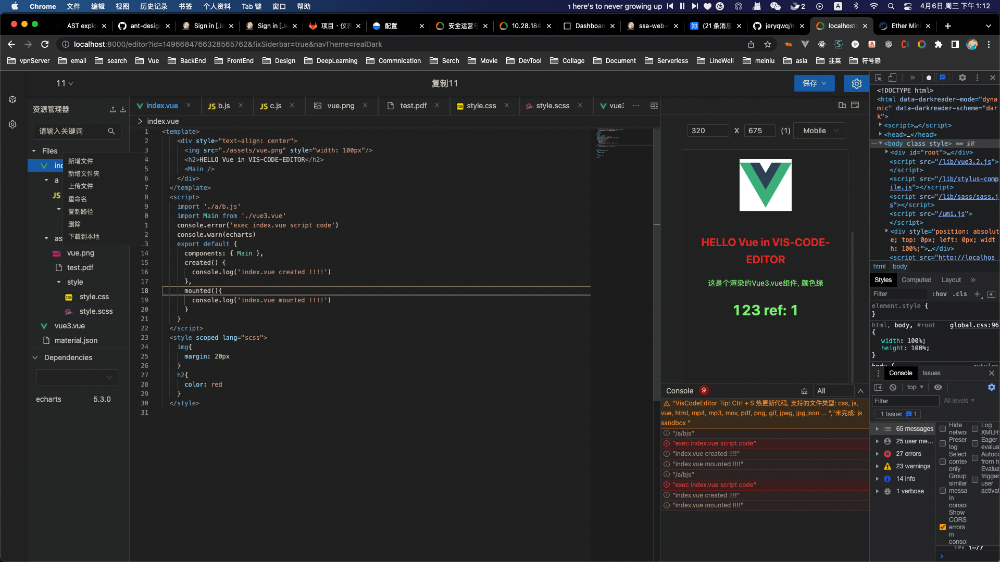

# umi project

## Getting Started

Install dependencies,

```bash
$ yarn
```

Start the dev server,

```bash
$ yarn start
```
## 物料


## 文档
接口文档： https://asiainfo-sec.feishu.cn/docs/doccnh5OOnTbG68JJ5S9WLrnobc
需求设计： https://asiainfo-sec.feishu.cn/docs/doccnNuNuG6E4XfDQ9Ht6G9gMHc#QUFaqB
第三方项目接入物料： https://asiainfo-sec.feishu.cn/docs/doccnwhOFvxpdgeCDGpJeH5tIws
